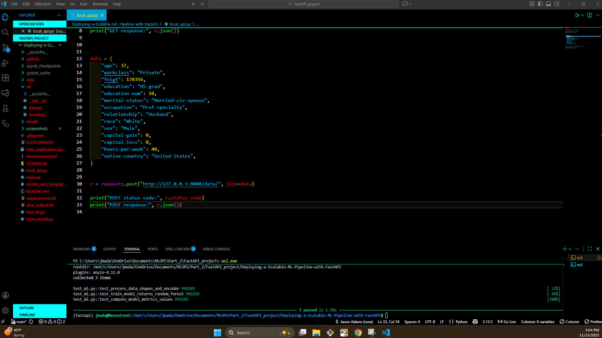
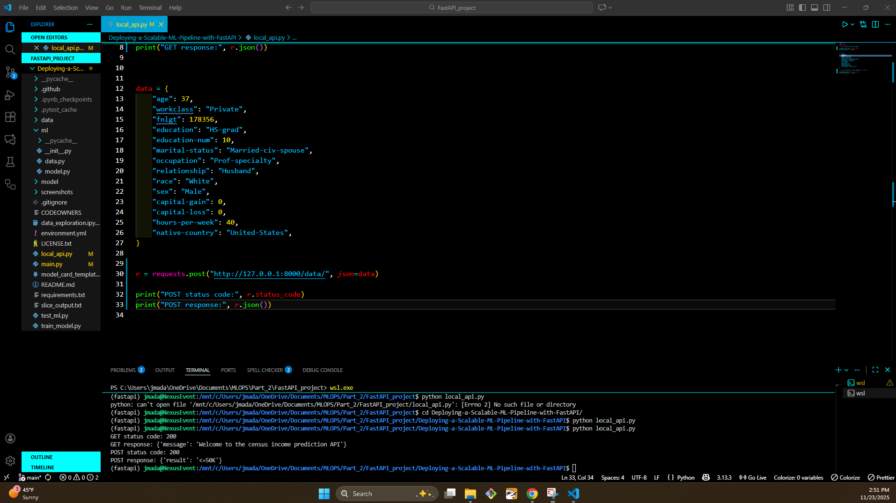
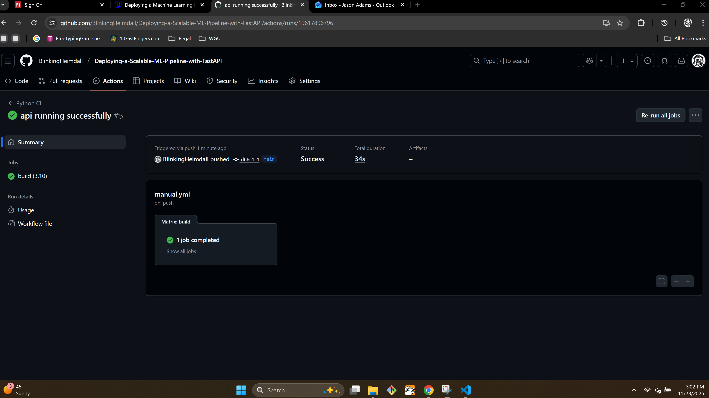

#  Deploying a Scalable ML Pipeline with FastAPI  
** MLOps Project**

This repository contains my implementation of the “Deploying a Scalable ML Pipeline with FastAPI” project.
The project demonstrates building, evaluating, and deploying a machine learning model using production-ready MLOps practices.  

# Project Structure

## 📂 Project Structure

<details>
<summary><strong>Click to expand</strong></summary>
<br>


```plaintext
├── ml/
│   ├── data.py                 # Data processing utilities
│   ├── model.py                # Model training, inference, and slice evaluation
│
├── model/
│   ├── model.pkl               # Saved RandomForestClassifier model
│   ├── encoder.pkl             # Saved OneHotEncoder used during training
│
├── data/
│   ├── census.csv              # Census dataset (input)
│
├── train_model.py              # Full ML pipeline: preprocess, train, save, slice eval
├── main.py                     # FastAPI application for inference
├── local_api.py                # Client to test API GET and POST
├── test_ml.py                  # Unit tests (pytest)
├── slice_output.txt            # Model performance on data slices
│
├── model_card.md               # Completed model card following rubric template
│
├── screenshots/
│   ├── continuous_integration.png   # Passing GitHub Actions CI
│   ├── local_api.png                # Successful GET and POST outputs
│   ├── unit_test.png                # Passing pytest screenshot
│
├── requirements.txt
└── README.md
```
</details> 

# Project Overview

This project walks through the full machine learning lifecycle:

1. **Data Preprocessing**
2. **Model Training & Saving Artifacts**
3. **Model Evaluation (Including Slice Performance)**
4. **Unit Testing**
5. **Building a REST API with FastAPI**
6. **Interacting with the Deployed API**
7. **Automated CI using GitHub Actions**

# Model

- **Model Type:** RandomForestClassifier  
- **Task:** Binary classification — Predict income: `<=50K` or `>50K`  
- **Dataset:** UCI Adult Census dataset (1994) 
- **Performance Metrics:**
  - Precision: **0.7353**
  - Recall: **0.6378**
  - F1 Score: **0.6831**

Additional slice metrics are available in `slice_output.txt`.

A full model card is available in: **model_card.md**

# Running Unit Tests

To run all tests:

```
pytest -v
```


### Unit Tests



# Training the Model

```
python train_model.py
```

## Training Output Artifacts

Running `python train_model.py` produces the following artifacts:

- `model/model.pkl` — trained RandomForestClassifier model  
- `model/encoder.pkl` — trained OneHotEncoder used for categorical features  
- `slice_output.txt` — slice-based model performance metrics  

# Running the API

```
uvicorn main:app --reload
```

## Test in Browser

```
http://127.0.0.1:8000
```

You should see a welcome message.

## Interacting with the API (GET + POST)

The following command has to be run in a separate terminal:
```
python local_api.py
```
### Expected Outputs

- GET returns a welcome message
- Post returns a prediction (<=50K or >50K)




# Continuous Integration

Github Actions run:
- `flake8` for linting
- `pytest` for unit tests



# Submission
This repository is public and includes:
- Model + encoder artifacts
- Full ML pipeline
- Unit tests and screenshots
- Completed model card
- Passing CI workflow
- Working FastAPI app

Everything required for the  MLOps project rubric.


